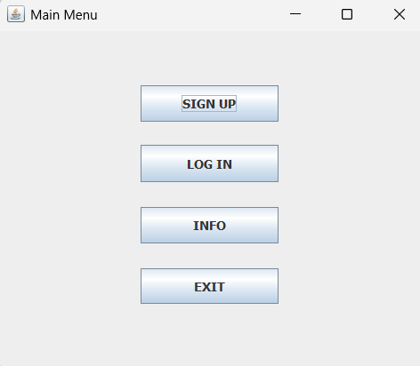
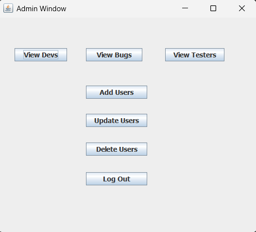
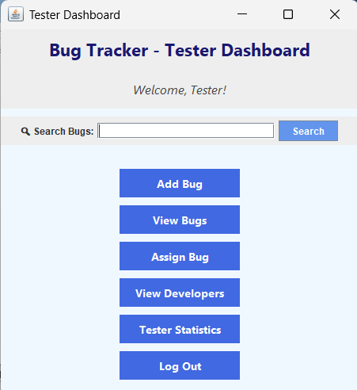
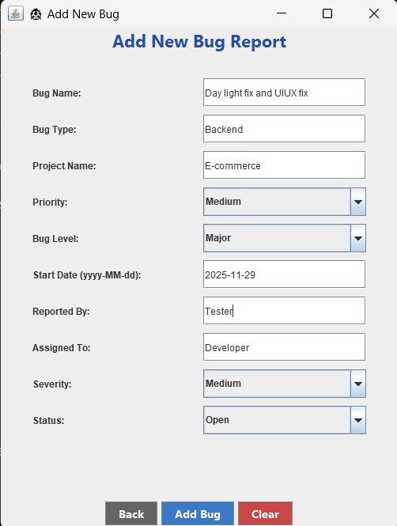
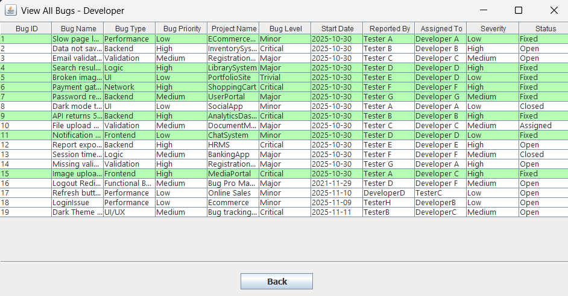

# Bug Tracking System

A desktop-based Bug Tracking System developed using **Java Swing**, **NetBeans IDE**, and **MySQL** to simplify software bug management and team collaboration. The application provides role-based access for **Admin**, **Tester**, **Developer**, and **Project Manager**, enabling efficient bug reporting, assignment, tracking, and performance monitoring.

---


---

## Project Overview

The Bug Tracking System is designed to streamline the software testing and development lifecycle by allowing different users to perform their respective tasks through dedicated dashboards.

The application enables testers to report software bugs, project managers to assign and monitor issues, developers to resolve assigned bugs, and administrators to manage users through dedicated dashboards.

---

## Features

### Admin

* Add new users
* Update user details
* Delete users
* View all bugs
* View developers
* View testers

### Tester

* Add new bugs
* View reported bugs
* Assign bugs
* View developers
* View tester statistics

### Developer

* View assigned bugs
* Mark bugs as completed

### Project Manager

* Monitor bugs
* Monitor developers
* Monitor testers
* Check team performance

---

## Technologies Used

* Java
* Java Swing (GUI)
* NetBeans IDE
* MySQL
* JDBC

---

## Project Structure

```text
BugTracker
│
├── src/
├── nbproject/
├── database/
│   └── bugtrackingsystem.sql
├── screenshots/
├── docs/
├── test/
├── build.xml
├── manifest.mf
├── README.md
└── .gitignore
```
---

## Database

The MySQL database script is available inside:

```
database/bugtrackingsystem.sql
```

Import the SQL file before running the application.

---

## How to Run

1. Clone the repository.

```bash
git clone https://github.com/rakshitha-prabhuswamy/BugTracker.git
```

2. Open the project in NetBeans IDE.

3. Import `database/bugtrackingsystem.sql` into MySQL.

4. Update the database credentials in `DBConnection.java` if required.

5. Clean and Build the project.

6. Run the application.

---

## Application Preview

### Main Menu



---

### Admin Dashboard



---

### Tester Dashboard



---

### Add Bug



---

### View Bugs



---

## Project Documentation

The complete project report is available here:

**[Bug Tracking System Report](docs/Bug_Tracking_System_Report.pdf)**

---


